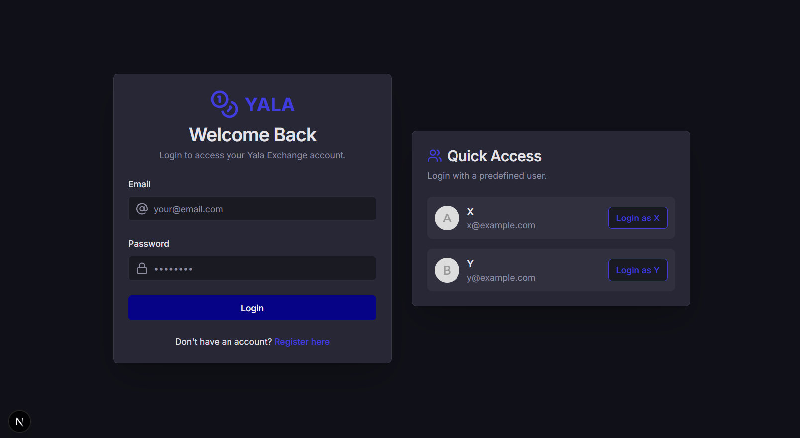
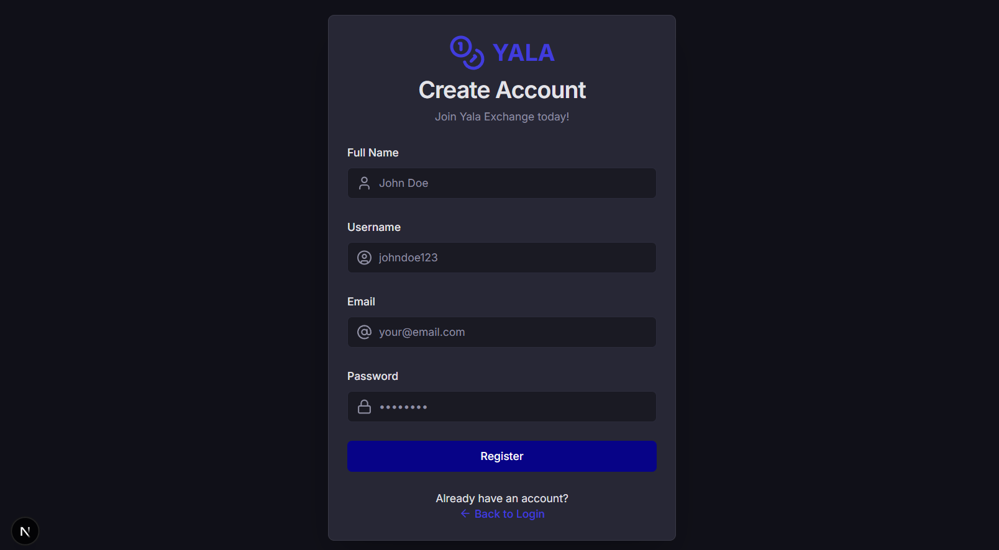
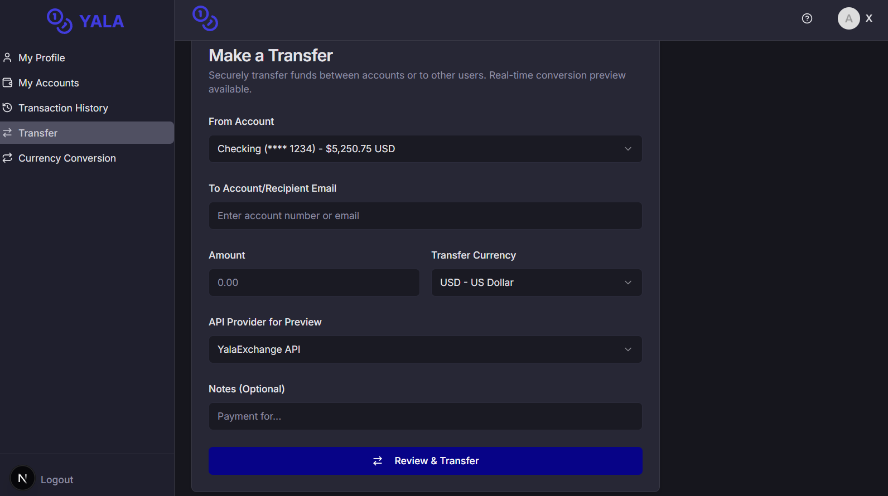
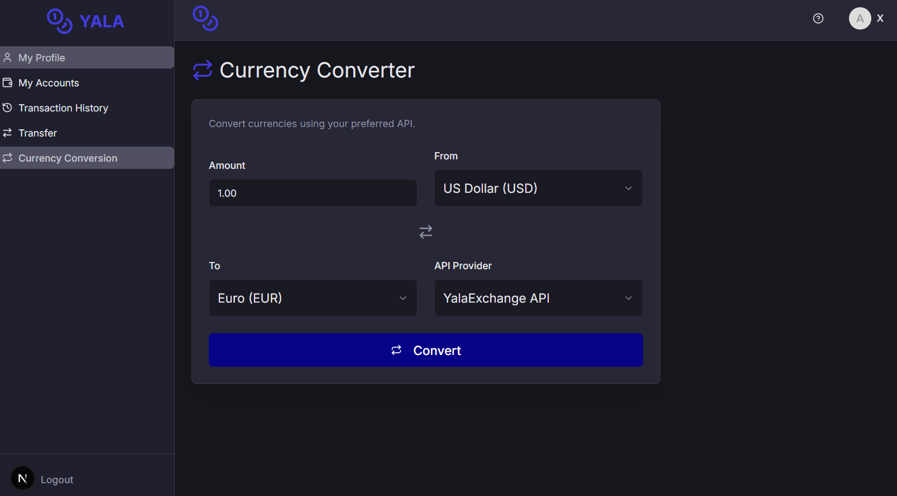
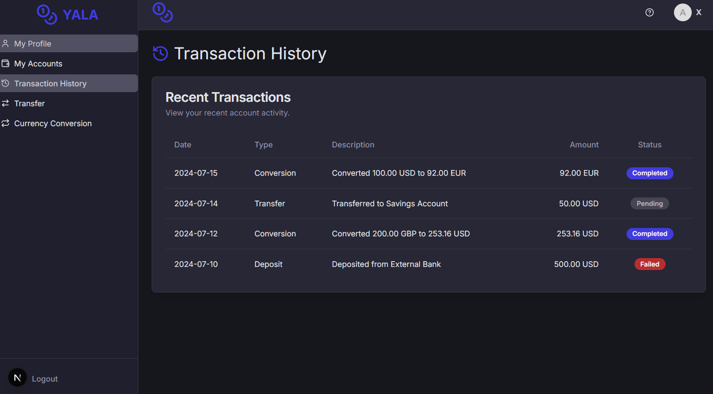
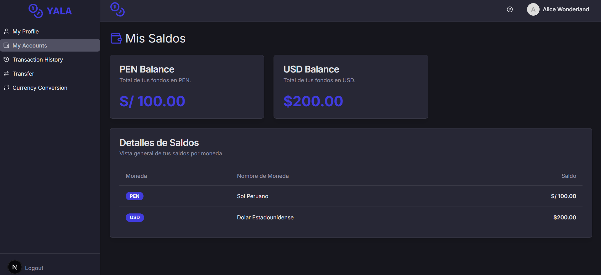

# 💸 YALA - Sistema de Gestión de Cuentas y Transacciones

## 📋 Descripción del Proyecto
YALA es una aplicación de gestión financiera que permite a los usuarios administrar cuentas en diferentes monedas, realizar transacciones entre ellas y gestionar tipos de cambio.

---

## 🚀 Configuración Inicial


    
### 1️⃣ Clonar el repositorio
```bash
git clone https://github.com/Yala-Software/frontend
cd backend
```

### 2️⃣ Configurar api backend
```bash
API_BACKEND=https:\\localhost:8000
```

### 3️⃣ Instalar dependencias
```bash
npm install
npm run build
npm run start
```

Este proyecto implementa una API para un sistema de intercambio de monedas, permitiendo a los usuarios gestionar saldos en diferentes divisas, realizar transferencias y consultar tasas de cambio en tiempo real.

## 🚀 Requisitos Funcionales

El sistema cumple con los siguientes requisitos funcionales:

* **Gestión de Usuarios y Cuentas:** Soporta múltiples usuarios, cada uno con cuentas en al menos dos monedas: Soles (S/.) y Dólares (USD).
* **Visualización de Estado de Cuenta:** Ofrece un endpoint para consultar el estado de cuenta de un usuario específico, mostrando los saldos por moneda.
* **Consulta de Tasa de Cambio:** Permite consultar la tasa de cambio entre dos monedas, obteniendo la información de una API externa en tiempo real.
* **Transferencia de Valores:** Habilita la transferencia de fondos:
    * Entre diferentes monedas para un mismo usuario (cambio de moneda).
    * Entre usuarios en la misma moneda.
    * Entre usuarios en diferentes monedas (realizando la conversión con la tasa online).
* **Historial de Operaciones:** Permite visualizar el historial de todas las operaciones realizadas por un usuario.


## ✨ Requisitos No Funcionales

Se han implementado los siguientes requisitos no funcionales para asegurar la robustez y evaluabilidad del sistema:

* **Inicialización de Usuarios:** La aplicación se inicializa con los siguientes usuarios y saldos predefinidos:
    * **Usuario X:** S/. 100, USD 200
    * **Usuario Y:** S/. 50, USD 100
* **Acceso por Endpoints:** Todas las operaciones y consultas se realizan a través de endpoints RESTful.
* **Lenguaje de Implementación:** El lenguaje de programación utilizado es **[Python / Java / Node.js /]**.
* **Integración con Múltiples APIs de Cambio:** Se han integrado al menos dos APIs externas para la consulta de tasas de cambio (ej. `ExchangeRate-API`, `Open Exchange Rates`).
* **Formato de Datos:** Todos los intercambios de datos (solicitudes y respuestas) utilizan el formato **JSON**.
* **Uso de Interfaces:** Se ha implementado una interfaz para abstraer la lógica de las APIs de cambio de monedas, permitiendo alternar fácilmente entre ellas.
* **Patrones de Diseño:** Se han aplicado al menos dos patrones de diseño:
    * **Singleton:** Para la gestión del acceso a las APIs de cambio de monedas.
    * **Adapter:** Para normalizar los resultados obtenidos de las diferentes APIs de cambio, asegurando un formato consistente.
    * **Observer:** Para actualizar el historial de transacciones de un usuario automáticamente tras cada operación.

## 🛠️ Tecnologías Utilizadas

* **Framework Web:** **[Next.js]**

## 🚀 Puesta en Marcha

Sigue estos pasos para levantar la aplicación:

* **Visualización en la Aplicación:**








## 🌟 Características Opcionales (Si Implementadas)

* **Soporte de Más Monedas:** Se ha extendido el soporte para otras monedas además de Soles y Dólares.
* **Autenticación de Usuario:** Implementación de un sistema básico de usuario/contraseña para acceder a los endpoints.
* **Interfaz de Usuario:** Una interfaz de usuario basada en [Consola / Web] para interactuar con la API.
* **Formatos de Exportación:** Posibilidad de exportar historiales o estados de cuenta en formatos como CSV o XML.
* **Serialización de Datos:** El estado de la aplicación (usuarios, saldos, historial) se serializa para persistir los datos entre reinicios.

